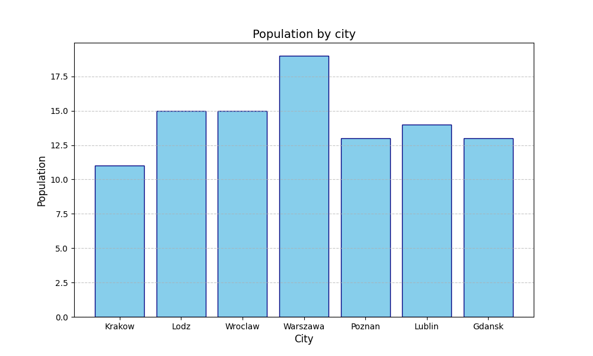

# Recruitment-Task-Python
Recruitment task for internship program
# User Data Analysis Tool

Technical tool for processing, analyzing, and visualizing user data provided in JSON format.

## Functionality

- Data ingestion from JSON files with validation.
- Automated generation of sample datasets
- Age-based data filtering.
- Statistical analysis
- CSV export for processed data
- Generation of population and age distribution charts

## Project Structure

- `src/` - Core application logic (models, processing, visualization).
- `data/` - Default directory for input, output, and generated charts.
- `tests/` - Unit tests for core processing functions.
- `src/main.py` - Application entry point.

## Requirements

The project requires Python 3.8+ and the following libraries:
- `matplotlib`
- `pytest`

To install dependencies:
```bash
pip install -r requirements.txt
```
## Usage

The application is operated via command-line arguments.

### Execution

```bash
python -m src.main --input data/users.json [options]
```

### Command-line Arguments

| Argument | Description |
| :--- | :--- |
| `-i, --input` | Path to the source JSON file |
| `-f, --filter-age` | Minimum age threshold for filtering (int) |
| `-o, --output` | Destination path for the CSV export. |
| `-p, --plot` | Enable generation of visualization charts. |

### Example Command

```bash
python -m src.main -i data/users.json -f 25 -o data/results.csv -p
```

## Testing

Automated unit tests are implemented using the `pytest` framework.
To execute the test suite:

```bash
pytest
```

## Visualizations

### Population by City


### Average Age by City

